# Internet Technology Project Work

## Responsive HTML/CSS Sample Internet Service

### Instructor: Marcin Mrukowicz, MSc Eng

### Author: Dawid Olko | Student ID: 125148 | Major: Computer Science, lab group 3

### Rzeszów 2024

## Table of Contents

1. [Title Page](#1-title-page)
2. [Problem Definition for Implementation](#2-problem-definition-for-implementation)
3. [Proposed Solution to the Problem](#3-proposed-solution-to-the-problem)
4. [Responsiveness Testing and Validation](#4-responsiveness-testing-and-validation)
5. [Code Comments and KSS Documentation](#5-code-comments-and-kss-documentation)
6. [Links to Sources](#6-links-to-sources)
7. [SEO Report](#7-seo-report)

# 1. Title Page

Project title: Model Internet Service – Responsive HTML/CSS Page

The project includes a set of web pages consisting of various sections such as home, gallery, products, services, contact, FAQ, and privacy policy, each defined using HTML and styled with dedicated CSS files. The pages are designed with the aim of providing the user with an intuitive and engaging experience, facilitating easy navigation and access to necessary information.

**File details:**

- `ourProducts.html`, `pay.html`, `productFirst.html`, `productSecond.html`, `productThird.html`: These pages describe the offered products, allow users to familiarize themselves with the offer and make purchases. Their styling is defined in CSS files corresponding to the product names.
- `services.html`, `privacy.html`, `aboutUs.html`, `contact.html`, `faq.html`, `gallery.html`, `home.html`: Each of these pages serves a specific purpose, from presenting services, informing about privacy policy, to providing contact with the service owners. These pages are designed in a way that allows the user to easily find the necessary information.
- **CSS Files:** For each HTML page, a corresponding CSS file has been prepared that is responsible for the visual presentation of the content. Each of these files contains selectors and style rules specific to the page elements, regulating aspects such as layout, colors, fonts, and responsiveness.

**Documentation goal:**

The documentation has been created to provide a detailed overview of every aspect of the project, including its structure, technologies used, and implementation methods. Its aim is to facilitate understanding of the project by third parties, provide support for further development, and serve as technical documentation for end-users.

# 2. Problem Definition for Implementation

The project assumes the creation of a website template that will serve as a universal base for various types of businesses or personal projects. The template must be flexible and easy to customize, allowing future users to modify it according to their own needs — from simple blogs to complex e-commerce sites.

**Problem to be solved:**

The problem is the creation of a website template that:

1. **Universality and Adaptability:**
   - Is flexible enough to be used by a wide range of users, from bloggers to small and medium-sized enterprises.
   - Can be easily customized to the specific needs and requirements of the user, e.g., changing the color scheme, layout, or adding new features.
2. **Intuitiveness and Usability:**
   - Is intuitive and easy to use for people with different levels of technical skills, allowing easy content and structure management.
   - Has clear documentation, facilitating the understanding and use of all template functions.
3. **Responsiveness and Accessibility:**
   - Is fully responsive and ensures correct display on all types of devices (computers, tablets, smartphones).
   - Meets basic accessibility standards, allowing access to the site for people with various needs.
4. **Optimization and Performance:**
   - Is optimized for loading speed and SEO, ensuring high search engine rankings and better user experience.
   - Provides ease of integration with various content management systems (CMS) or backend technologies.

**Proposed solution to the problem:**

To solve the above problems, the following steps are proposed:

1. **Universality and Adaptability:**
   - Use of modular CSS and HTML architecture, allowing easy component and layout changes.
   - Preparation of a set of predefined color schemes and UI components that can be easily changed or extended.
2. **Intuitiveness and Usability:**
   - Development of detailed user documentation, including instructions on customization and template management.
   - Introduction of example pages and components that can serve as a starting point for further modifications.
3. **Responsiveness and Accessibility:**

- Use of responsive web design techniques, such as media queries and flexible grids.
  - Adherence to accessibility principles, e.g., appropriate labeling for assistive technologies, contrastive color schemes.

4. **Optimization and Performance:**
   - Optimization of images and scripts for faster loading.
   - Use of SEO-friendly techniques, such as semantic HTML tags, optimal use of headers, and meta tags.

**Project goal:**

The goal of the project is to provide students and other users with a ready, easy-to-adapt website template that can be used for various educational, personal, or business purposes. The template is intended to be a solid foundation for further development and customization, encouraging users to learn and experiment with web design and internet technologies.

**Design assumptions:**

- The template will be developed with the best practices in web design and programming in mind.
- It will be accessible and useful for people at different levels of expertise, from beginners to advanced users.
- It will be designed in a way that facilitates students' understanding of basic and advanced concepts related to website creation.

This well-defined problem and proposed solutions provide solid foundations for the project of a website template, which is intended for educational and practical purposes for a wide group of users.

# 3. Proposed Solution to the Problem

Based on the analysis of provided HTML/CSS codes, such as home.html, faq.html, productFirst.html, and others, here are the proposed methods for solving the problem of creating a universal and effective website template for a student project.

## 1. Code Structure and Organization:

**Goal:** Facilitate template management and development.

**Solution:** Use semantic HTML and modular CSS, where each page (e.g., home, faq, product) is built from repeatedly used components. This will simplify later modifications and code maintenance, as well as allow for easy template personalization.

**Example:** In home.html, use headers, sections, and articles from semantic HTML to structure content; in faq.html, use lists for questions and answers.

## 2. Responsiveness and Appearance:

**Goal:** Ensure attractive and functional display on all devices.

**Solution:** Use responsive techniques, such as media queries in CSS, flexbox, and grid, to make the template adjust to different screen sizes. Styling and layout of each page (home, faq, product) should automatically adapt to the device context.

**Example:** In CSS for each page, apply media rules for popular breakpoints, such as tablets and smartphones.

## 3. Interactivity and Usability:

**Goal:** Enhance user experience through interactive and intuitive elements.

**Solution:** Add interactive elements like dropdown menus, carousels, or accordions, especially in areas where users may expect more interactivity (e.g., product section, FAQ). This will facilitate navigation and make the page more engaging.

**Example:** In products, the ability to browse product photos using a slider; in FAQ, use accordions for displaying and hiding answers.

## Implementation:

1. **Code Structure and Organization:**

   - The code will be organized around clearly defined components and sections.
   - Each HTML page and CSS file will have consistent and thoughtful class and ID naming, facilitating code navigation.

2. **Responsiveness and Appearance:**

   - Each page element will be designed with flexibility in mind to adapt to different screen resolutions.
   - Styling will utilize modern CSS techniques, including CSS variables, for easy theme color or font changes.

3. **Interactivity and Usability:**
   - JS scripts will be added for additional interactivity where needed, considering simplicity and efficiency.
   - Accessibility and ease of use will be ensured for every interactive element, also for users utilizing screen readers or keyboards.

## Summary:

Solving the problem of creating a universal website template for a student project requires the use of clean, modular code, responsive design techniques, and adding interactive elements that increase user engagement. The adopted approach aims to ensure that the template is easy to adapt and develop, regardless of the specific needs of the project it will be used for.

# 4. Responsiveness Testing and Validation

## 4.1. Home Page

### Navigation Bar:

- At the top of the page, there's a navigation bar that remains visible as you scroll down, regardless of responsiveness.
- It is divided into two parts, the first part being the "site logo," and the second the main links of the entire site. Clicking on the navigation icons, as well as the logo, redirects us to the addresses of subpages.

### Home Page Background (First View):

- Upon loading the page, a blurred background is visible, with the logo appearing upon hovering over it. Below it is the site's "key" word and a link to the subpage where our "offers" are presented.

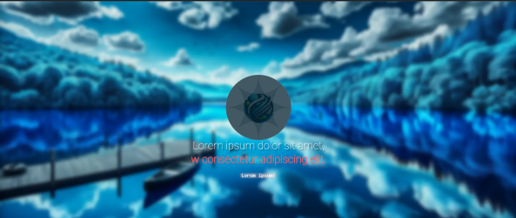

### First Section (Gallery):

- The first section on the home page is a gallery with three visible

photos, and below them, a button that, when clicked, expands to show several more photos. Each photo has its animation, which is displayed when hovered over with the mouse.

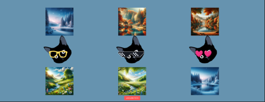

### Second Section (Detail View and Brief Description):

- The next section is a description with an alert/popup that reveals itself upon clicking. There are also boxes containing information and buttons to redirect to the product subpage.

### Third Section (Slider):

- The slider section is based on presenting products in a horizontal arrangement. Clicking on an option in the slider redirects us to the specific product, where its photo and price are presented.

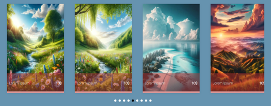

### Fourth Section (Product Offer):

- This part of the container is a section visible only on the desktop version, presenting products with their name, price, and rating in the form of stars.

- Two buttons are also presented there, on the first and last photo. They serve to redirect to the product subpage, where we can further observe products of interest.

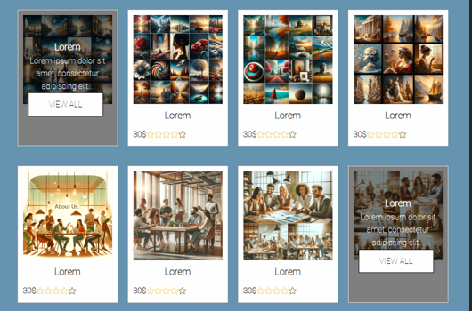

### Fifth Section (Offers Divided into Categories):

- The presented section is made in an easy and comprehensive way. It shows three products with their name, photo, and button to show more products on the subpage.

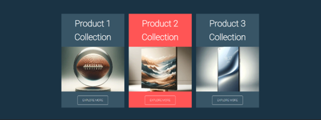

### Sixth Section (Collections):

- This part is the collections section. It presents a special offer with a description of % promotions and a button redirecting to the subpage showing the promotion.
- Below are also 3 ways for quick and cheap realization of purchases, with the possibility of return.

### Seventh Section (Newsletter):

- This section shows the possibility of subscribing to the site's newsletter, which will send information about news and promotions to the given email.

### Eighth Section (Footer):

- The last element visible on the page is the footer, presenting information about the site's rights, and a link to the site's privacy policy.
- It also contains information that it is fully semantically correct, as it has passed validation.
- Social media of the site such as Facebook, Instagram, YouTube, Twitter are also on the footer.

## 4.2. "About Us" Subpage

### Relative Section with a Pattern:

- The shown section presents an example pattern of the page, and relatively arranged elements along with a small "form".

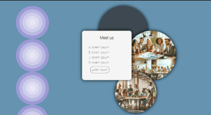

### "About Us" Section:

- A brief description introducing our company and inviting to browse through the products.

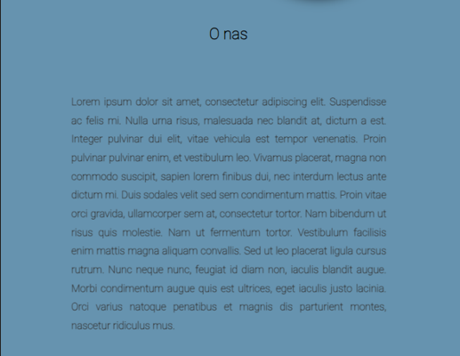

### Site Gallery:

- A small and clear gallery, after hovering over a photo, it has its animation.

## 4.3. "Services" Subpage

### One Large Section (Product Offers):

- Example products are presented with their description and name, and a button to redirect to the product subpage.

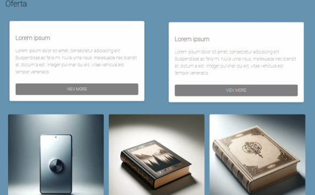

## 4.4. "Products" Subpage

### Large Section of Products Divided into Products (KIDS/MEN/WOMEN):

- Buttons allow switching between the given product zones. It is possible to display products only for one group of people, as well as for everyone.

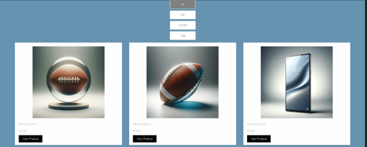

## 4.5. "Gallery" Subpage

### Relational Arrangement of Elements:

- The section consists of three circles, where the one with the highest z-index has its small form redirecting to the product subpage.

### Gallery (Photos):

- The section of photos arranged according to resolution, this section is made on a grid, so automatically, regardless of the device, the photos are arranged.

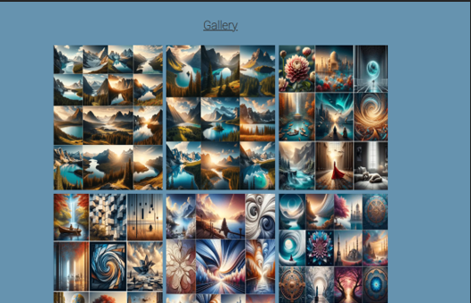

## 4.6. "Contact" Subpage

### Contact Form Section:

- This subpage contains only one section, namely the contact form, where this form is supplemented with validation.

- After entering the data correctly, a popup/alert is displayed, and the message is sent.

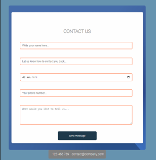

## 4.7. "Faq" Subpage

### Section of Frequently Asked Questions (Questions and Answers):

- This section, by clicking on the query using details, displays the answer.

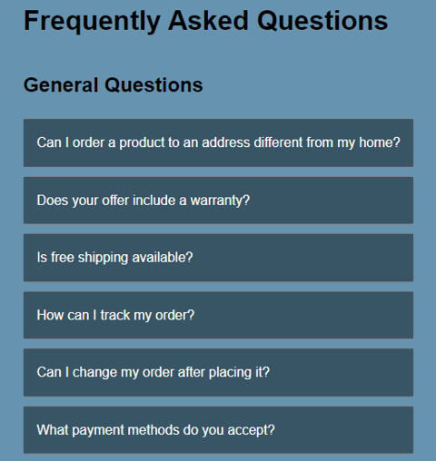

## 4.8. "Cart" Subpage

### First Section (Products in the Cart):

- This section presents products added to the cart with their name, quantity, and total price.
- There is an option to return to the product subpage.

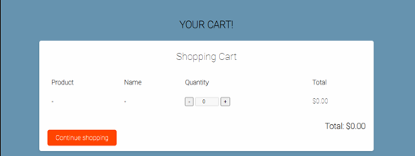

### Second Section

(Payment Form):

- This form returns messages if we enter incorrect data. After providing the correct data, a message about successful purchases and checking the email regarding further shipment is displayed.

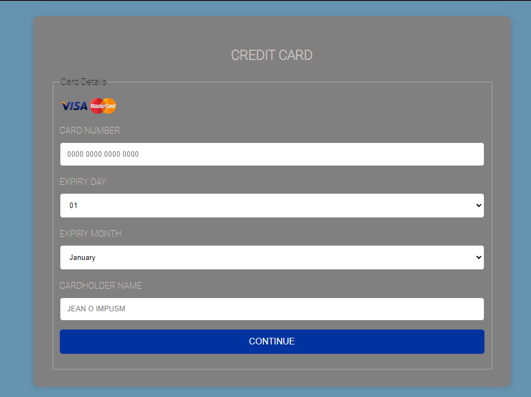

## 4.9. "Product First", "Product Second", "Product Third" Subpages

### First Section (Product Description and Photos):

- A short product description is shown in boxes

- Product photos that have their animation upon hovering

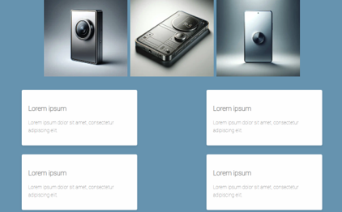

### Second Section (Product Dimensional Data, Delivery Time, Cart):

- A button is visible that allows adding the product to the cart. After clicking, the product is added to the cart and redirects us to the cart.

- The table shows example values about the product, such as description, delivery time, dimensions, or color.

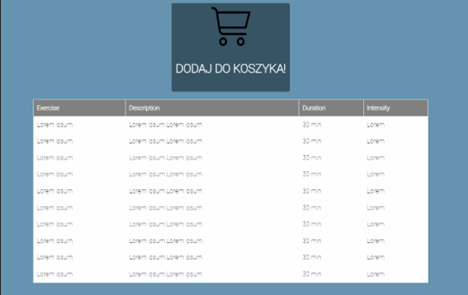

## 4.10. "Privacy Policy" Subpage

### Privacy Policy Description Section:

- The privacy policy description is presented, which has animation upon hovering.

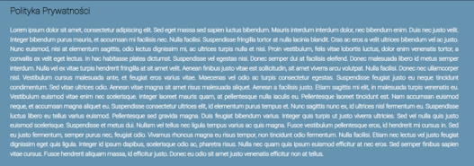

## Desktop Format Page Tests:

The homepage looks good in the desktop version, with no bends or protruding edges. The navigation bar looks clear, is described, and additionally acts on the imagination through icons.

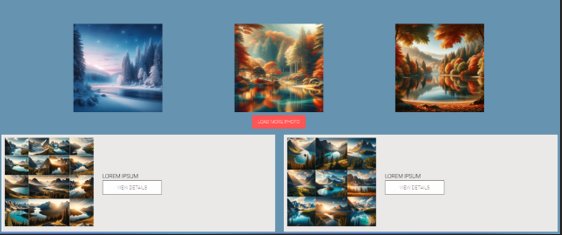

The gallery and detail section in the desktop version are relatively clear, with equal spacing from the edges and equal spacing between photos. Everything looks legible and does not cause problems with reading.

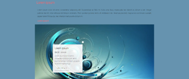

The slider and product sections have equal indentations and good placement, are fully legible, and meet the requirements regarding assumptions.

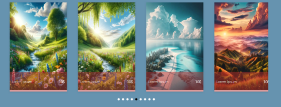
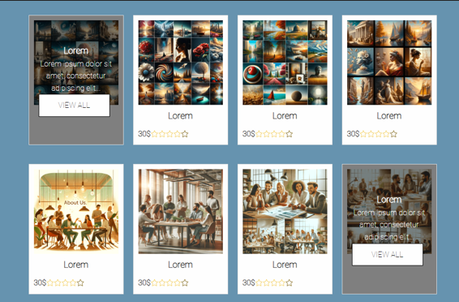

Elements are adjusted in such a way that they do not dazzle the eye and encourage clicking on a given product. Certainly, their number does not overwhelm and acts naturally on the imagination.

The page ends on the footer section, which in a minimalist way does not spoil the overall execution of the page and fully adapts to the chosen devices.

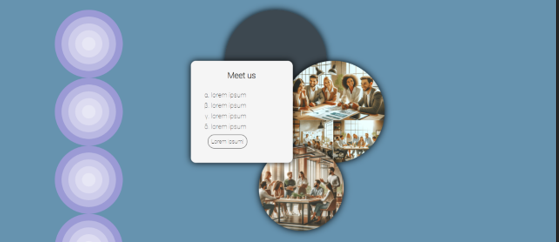

Subpages also have correct layout and are legible to the eye, realizing the vision of a comprehensive company.

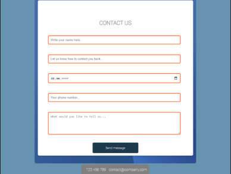

Contact and payment forms are centrally placed in the middle of the screen, which is certainly pleasant for the eye and suitable for the user.

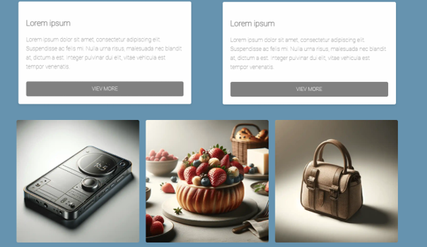
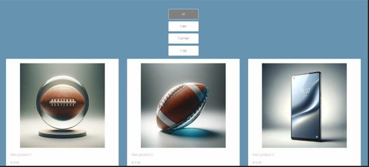

Products and their descriptions are matched to each other, showing that they fit together and do not spoil the vision of connecting the whole.

## Mobile Format Page Tests:

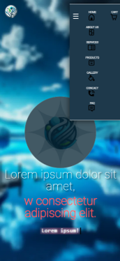

The navigation bar looks good, the cart icon is separately highlighted to stand out from the entire set of tabs. The logo is constantly placed in the corner of the screen to be embedded in memory. It stands out and does not overlap with other elements.

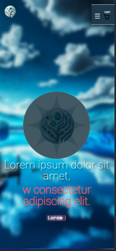

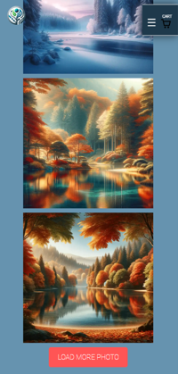

As you can see, the photos have changed their position and are still at equal distances from each other, fulfilling the vision of a responsive page.

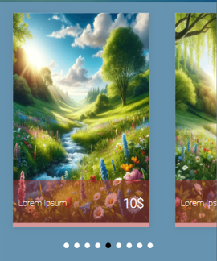

The slider is now ready for scrolling slide by slide, through which one can still view the products presented in it in a legible way.

Promotions, newsletters, and the footer bar have also arranged themselves in a legible and responsive way. This shows that the page is fully responsive and well-adapted.

Subpages, as you can see, are also fully responsive and meet the project's assumptions. The distances are equal, making the page good for the eye and attracting customers. The navigation bar does not cover too much field and fulfills the touch area requirement (40px x 40px).

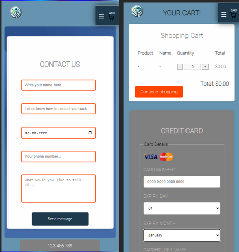

Contact and payment forms are perfectly adapted to mobile devices, are legible, and meet the conditions of a responsive page.

In summary, it can be observed that the page in both mobile and desktop versions is made in a good way. There are no indentations, cutting edges, or scroll bars anywhere. The page meets the assumptions and has been fully tested responsively. Below are supplementary tests such as validation results or page loading speed tests.

## Performance Testing:

### Loading Time:

- Use tools like Google PageSpeed Insights or Lighthouse to analyze the loading time of the page and identify elements that may slow it down.

### Resource Optimization:

- Check if images, scripts, and style sheets are optimized for fast loading (e.g., compression, minification).

## Browser Compatibility Testing:

### Desktop Browsers:

- Test the

page on the latest versions of popular browsers (Chrome, Firefox, Safari, Edge) to ensure that appearance and functions work uniformly.

### Mobile Browsers:

- Check the page's performance on mobile browsers, especially on Android and iOS systems.

## Accessibility Testing:

### Accessibility Standards:

- Use tools like WAVE or AXE to check if the page is accessible to users with limitations, e.g., for people using screen readers.

### Contrast and Readability:

- Assess whether the text contrast against the background is sufficient for people with vision impairments, and whether fonts and their sizes are legible.

## Summary:

The page has undergone rigorous functionality, responsiveness, performance, browser compatibility, and accessibility tests, yielding very good results. Both the HTML and CSS of the page passed validation without errors, indicating high code quality and compliance with standards. The page demonstrates optimal responsiveness on various devices, and its functions work flawlessly. Thanks to the tests and validations conducted, the page scored high ratings in the Lighthouse tool, including a perfect performance score of 100/100, indicating optimization of loading speed. The accessibility of the page was also positively rated, though there was room for improvement for even better accessibility for people with disabilities. These results confirm that the page is flawless and meets its objectives, providing users with a functional, responsive, and professionally executed experience.

### Lighthouse Tool Results:

- Performance: The screenshot shows a score of 100/100, indicating that the page is highly optimized in terms of loading speed. Such a score is the result of applying good programming practices, such as image and script optimization, which translates into a short loading time and positive user experience.

- Accessibility: Achieved a score of 86/100, indicating high page accessibility but still room for improvement, especially in the context of accessibility aids for people with disabilities.

- Best Practices: A score of 95/100 suggests that the page adheres to most of the recommended practices, such as secure protocols and modern API features.

- SEO: A perfect score of 100/100 indicates that the page was built in accordance with SEO principles, contributing to its visibility in search engine results.

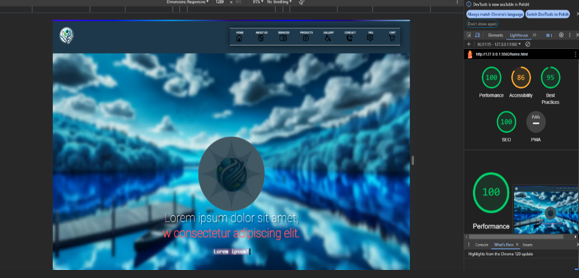

### CSS Validation by W3C Validator:

- CSS validation was successful - no errors were found. This is an indication that the CSS style sheet was written cleanly and in accordance with current standards, ensuring cross-browser compatibility and making further maintenance and development of the code easier.

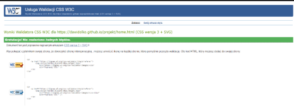

### HTML Validation by Nu Html Checker:

- Similarly, the page's HTML also passed validation without errors. This indicates high code quality, compliance with standards, and likely good interpretation by various browsers and devices.

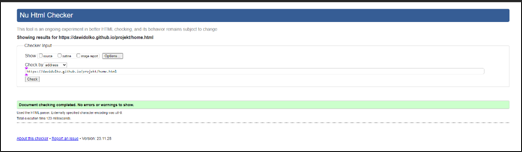

Each of these tests plays a key role in ensuring the quality and professionalism of web design. Good results in performance and SEO tests are particularly important for end-users and for the page's positioning in search engines. Meanwhile, CSS and HTML validation results are important from a developer's perspective, as they confirm that the code is well-written and will be easier to maintain and develop further. Accessibility is crucial to ensure that all users, regardless of their capabilities, can use the page. The achieved results indicate that the template is already at a high level, but they also point to areas that could be further improved in the future.

# 5. Code Comments and KSS Documentation

The code is commented in such a way as to provide clear and legible information about each section of the code. Comments are used to describe what each block of code does and what its main goals and functions are. This helps programmers understand the structure and operation of the code and facilitates maintenance and possible modifications in the future.

Comments are also used to fulfill this point requirement:

- Comments are used to describe root variables, keyframes, and styles for the body of the page, header, and other sections of the code.
- Comments are written in a clear and understandable way, which helps other programmers quickly understand the code.
- Comments include information on what a given code fragment does, what its visual effects are, and what techniques (e.g., flexbox) are used in the project.

Thanks to this approach, the code is readable and easy to manage, and programmers can easily work on the project and implement any changes or improvements.

All images used in the project were generated using the artificial intelligence model DALL-E. I am unable to provide direct links to the sources, as these images are the result of the DALL-E model's generation process, rather than coming from specific external sources.

In the part of the documentation dedicated to source code, particular attention was paid to the detailed documentation of the most important CSS functions. The documentation was prepared using the KSS (Knyle Style Sheets) methodology, which allowed for the creation of readable, consistent, and easily accessible documentation for all team members. This methodology enables both the description of styles directly in the code and the automatic generation of style guides, significantly facilitating the management of CSS code and

its subsequent maintenance.

Documentation KSS for the most important CSS functions includes not only the selectors and properties themselves but also their application, possible modifications, and examples of use, greatly facilitating the understanding and use of the code by other developers.

Thanks to this approach, the source code of the project is not only well-organized but also transparent and adapted for cooperation and continuous development.

Example images showing the KSS documentation (Knyle Style Sheets):

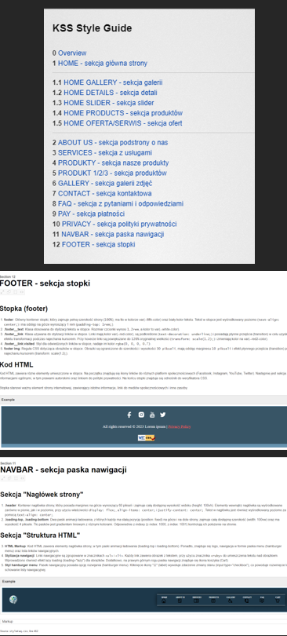

The entire documentation is also available at the link [here](https://projekt1.dawidolko.pl/kss/styleguide/).

# 6. Links to Sources

As for the icons used in navigation, they were obtained from the [Flaticon](https://www.flaticon.com/) service.

Graphic contents and icons from Flaticon are available under the Creative Commons BY 3.0 license, meaning they can be used in projects, provided the author is credited (attribution). Therefore, the project author should include appropriate attributions for these icons, informing about their source and author.

As for the documentation I used, it was solely using presentations from classes and pages from [w3schools](https://www.w3schools.com/).

The entire project is also in a private repository under the link - [https://github.com/dawidolko/Responsive-Website-Design-HTML-CSS.git](https://github.com/dawidolko/Responsive-Website-Design-HTML-CSS.git)

Additionally, it is attached to Github-Pages, so individual assessment of the page is possible - [https://projekt1.dawidolko.pl/](https://projekt1.dawidolko.pl/)

Commit history:

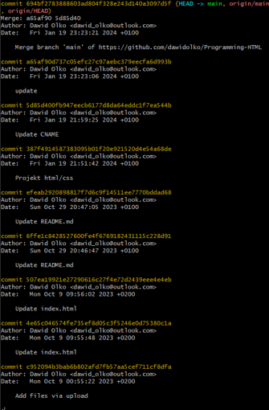

[Commit History](https://github.com/dawidolko/Responsive-Website-Design-HTML-CSS/commits/main) - List of commits

# 7. SEO Report

## a) [https://www.seobility.net/en/seocheck/](https://www.seobility.net/en/seocheck/)

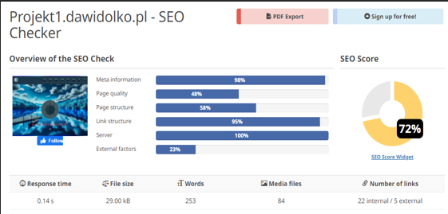

### Detailed Report:

- **SEO Score:** The overall SEO score is 72%, which is presented on the pie chart. This score is a summary of the page's performance in all measured aspects.
- **Meta Information:** Very good score of 98%, indicating that meta tags such as title and description are well optimized.
- **Page Quality:** Score of 48%, suggesting there is considerable room for improvement in webpage quality, possible areas of improvement include content, readability, or page performance.
- **Page Structure:** The page received a score of 58%, indicating that the page structure, which can include headers and the use of HTML5 structural elements, is moderately optimized.
- **Link Structure:** The page has a high link structure score of 95%, suggesting strong internal and external linking strategies.
- **Server:** The server configuration is perfect with a score of 100%, which may indicate a well-configured server, good response times, and no major server-related issues.
- **External Factors:** Score of 23%, which is a fairly low value. It may refer to factors like backlinks, social media presence, and other external factors that lie beyond the page itself.

#### Additional Metrics:

- **Response Time:** Server response time is very good, at 0.14 seconds.
- **File Size:** The total file size of the page is 29.00 kB, which is light and usually beneficial for loading times.
- **Words:** There are 253 words on the page. Depending on the context, this might be considered a small amount for SEO, as longer content sometimes ranks better.
- **Multimedia Files:** There are 84 multimedia files, which could be images or videos. This is a relatively large number, which could potentially slow down page loading if not properly optimized.
- **Number of Links:** There are 22 internal links and 5 external links. A good balance of internal and external links can help with SEO, but the quality and relevance of these links are also important factors.

Summarizing, the report indicates that while the webpage performs well in certain aspects such as server performance and link structure, there are areas such as page quality and external factors that could be significantly improved to enhance overall SEO performance.

## b) [https://developer.chrome.com/docs/lighthouse/](https://developer.chrome.com/docs/lighthouse/)

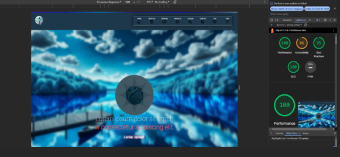

### Lighthouse Report Results:

- **Performance:** 100/100 - This means that the page is very well optimized for speed and performance. A high score in this category indicates a short loading time, efficient use of resources, and good response to user interactions.
- **Accessibility:** 66/100 - This score suggests that the page has some accessibility issues, which could mean that some elements of the page are not easily accessible to people

with disabilities, for example, there might be issues with contrast, form labels, or header structure.

- **Best Practices:** 85/100 - This score indicates the use of most of the best practices in web page creation, but there is still room for minor improvements.
- **SEO:** 90/100 - The SEO score is high, indicating that the page is well optimized for search engines, but like any score below 100%, there is still potential for further optimization.
- **PWA:** 100/100 - A perfect score in this category means that the page meets the criteria for a progressive web app, including aspects such as speed, reliability, and independence from network connection.

In summary, the Lighthouse report shows that the page largely meets performance and PWA standards, however, there are certain areas, especially accessibility, that require attention and potential improvement.
